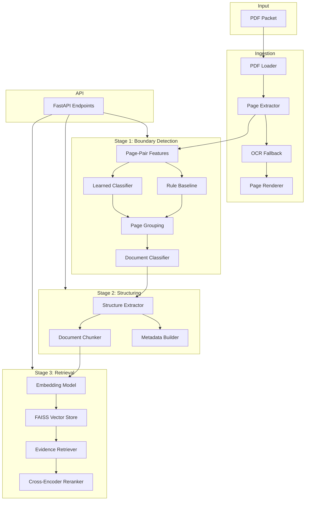

# Architecture

## Component Diagram



## End-to-End Data Flow

1. **PDF Ingestion**: PyMuPDF loads pages, extracts native text/blocks, OCR fallback for scanned pages
2. **Stage 1**: Adjacent page pairs → feature vectors → boundary classifier → contiguous groups → document type classification
3. **Stage 2**: Grouped pages → structured JSON (sections, blocks, tables) → semantic chunks with provenance
4. **Stage 3**: Chunks embedded → FAISS index → query embedding → top-N search → optional rerank → evidence results

## Stage 1 Flow

```
Pages [1..N]
    → For each pair (i, i+1):
        - Semantic cosine similarity (embeddings)
        - Token Jaccard overlap
        - Layout/block similarity
        - Structural signals
        - Type agreement hint
    → Boundary score
    → Threshold or learned classifier
    → Group contiguous pages
    → Classify each group
```

**Target convention**: label 1 = same document, label 0 = boundary

## Stage 2 Flow

```
Document Group + Pages
    → Extract headings (font size heuristic)
    → Group blocks into sections
    → Preserve page references
    → Generate metadata (hashes, timestamps)
    → Chunk by section boundaries
    → Attach chunk_id, document_id, page range
```

## Stage 3 Flow

```
Structured JSON
    → Chunk text
    → Batch embed (Sentence Transformers)
    → Store in FAISS (inner product, normalized)
    
Query
    → Normalize text
    → Embed query
    → Top-N vector search
    → Optional metadata filter (document_type)
    → Optional cross-encoder rerank (top-N only)
    → Return evidence with scores
```

## Data Schemas

### StructuredDocument
- `document_id`, `document_type`, `confidence`
- `source`: packet_id, source_file, page_start, page_end
- `content`: title, sections[].blocks[]
- `metadata`: extraction_method, content_hash, warnings

### Chunk
- `chunk_id`, `document_id`, `document_type`
- `page_start`, `page_end`, `section`, `text`, `metadata`

### Evidence
- `document_id`, `document_type`, `page`, `chunk_id`
- `evidence` (text), `score`, `vector_score`, `rerank_score`

## Storage Design

| Store | Location | Contents |
|-------|----------|----------|
| Raw PDFs | `data/raw/` | Input packets |
| Processed | `data/processed/` | Dataset manifests, training artifacts |
| Indexes | `data/indexes/default/` | FAISS index + metadata JSON |
| Outputs | `outputs/` | Stage results, benchmarks, samples |
| Models | `models/` | Boundary classifier, embedding cache |

## Model Boundaries

- **No LLM for boundary detection** — engineered features + small classifiers
- **Embeddings** — general-purpose Sentence Transformers only
- **OCR** — fallback only when native text insufficient
- **Reranker** — optional, top-N only
- **LLM** — optional adapter (Gemini), not required for pipeline

## API Boundaries

| Endpoint | Input | Output |
|----------|-------|--------|
| POST /analyze | PDF file | Document groups, types, boundaries |
| POST /index | Structured docs or stage1+pdf | Index statistics |
| POST /retrieve | Query string | Ranked evidence list |
| GET /health | — | Status |

All responses preserve document/page provenance. No conversational answer generation.
